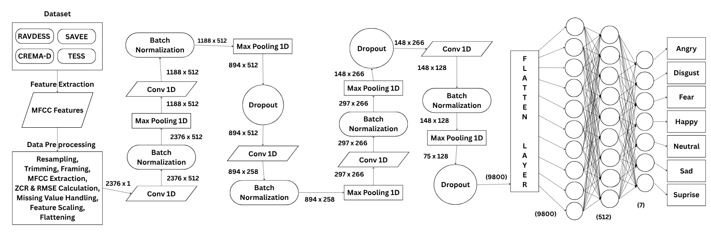
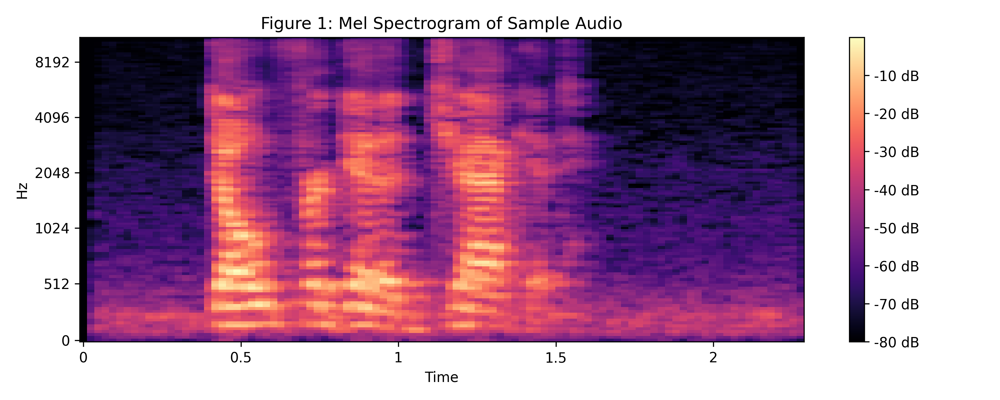
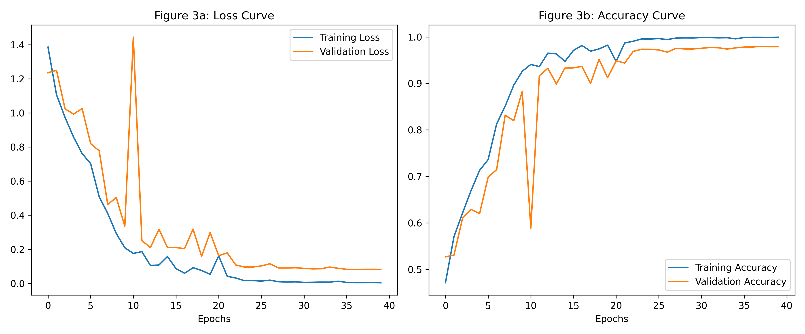
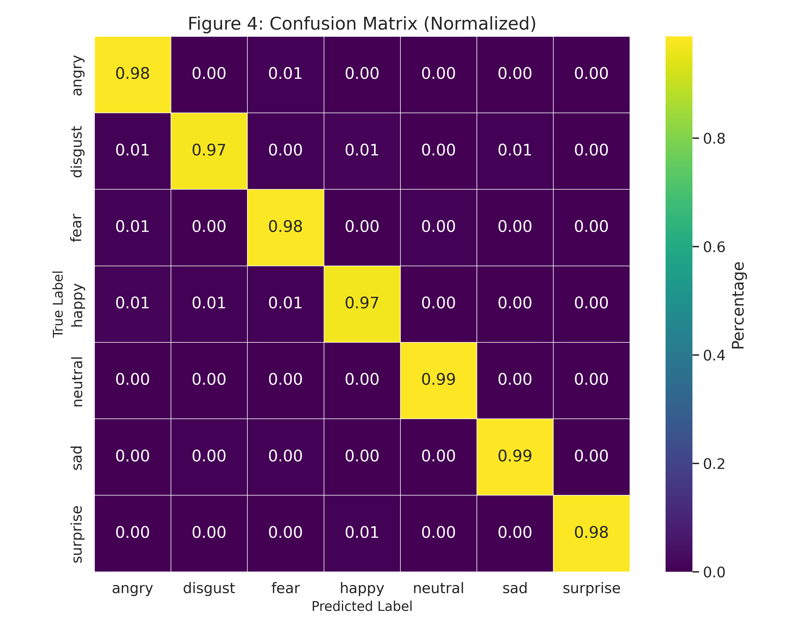
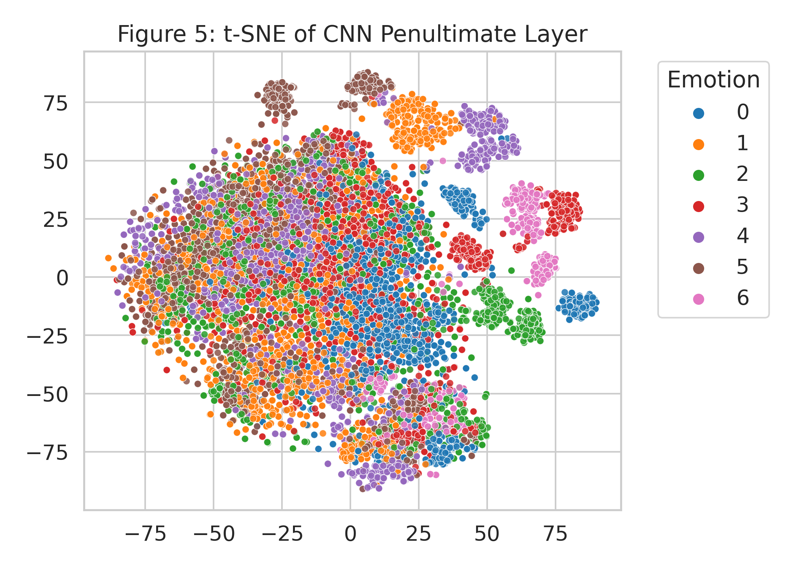
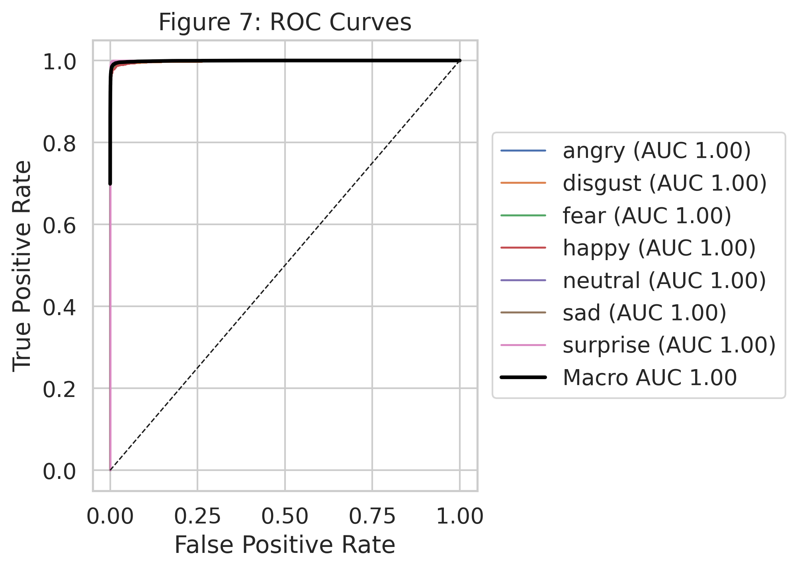
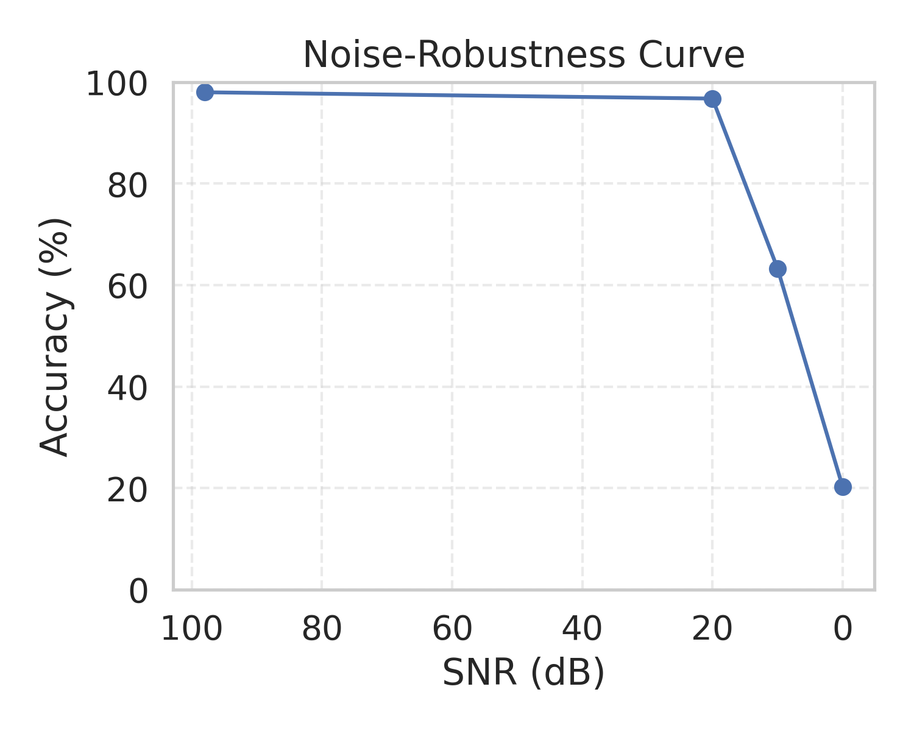

# Cross-Corpus Robust Speech Emotion Recognition (SER)


An end-to-end, deep learning framework for **Speech Emotion Recognition (SER)** across multi-corpus acoustic domains. Featuring a **5-Block 1D Convolutional Neural Network (1D-CNN)** operating on frame-level acoustic feature representations ($ZCR \parallel RMSE \parallel \text{MFCCs}$), this repository provides comprehensive evaluation routines for cross-corpus generalization (Leave-One-Dataset-Out / LODO), fine-tuning adaptation, and SNR noise robustness.

---

## Executive Summary

> [!IMPORTANT]
> **Key Benchmark Result**: Achieves **98.03% classification accuracy** and **0.980 Macro-F1** on a consolidated held-out test split of **9,730 test samples** across four harmonized speech-emotion corpora.

### Key Contributions & Features
- **Harmonized Multi-Corpus Training**: Combines audio samples from **CREMA-D**, **RAVDESS**, **SAVEE**, and **TESS**, spanning 7 core emotion classes: `angry`, `disgust`, `fear`, `happy`, `neutral`, `sad`, and `surprise`.
- **End-to-End Pipeline**: Unified workflow from raw audio signal processing and acoustic feature extraction ($2,376$-d vector) to 1D-CNN inference.
- **Cross-Corpus Transfer (LODO)**: Systematic Leave-One-Dataset-Out evaluations measuring out-of-domain transferability and target-domain fine-tuning gains.
- **Noise Robustness**: Evaluated against additive white Gaussian noise across varying Signal-to-Noise Ratios (10 dB SNR).

---

## System Architecture & End-to-End Workflow

The complete end-to-end processing pipeline—from multi-dataset ingestion and acoustic preprocessing to 1D-CNN feature learning and 7-class emotion prediction—is illustrated below:



### 1D-CNN Model Architecture Specifications

The neural classifier consists of 5 **1D Convolutional Neural Network (1D-CNN)** blocks designed to learn discriminative temporal-spectral features across frame vectors:

- **Input Dimension**: $(1, 2376, 1)$
- **Block 1**: `Conv1D` (512 filters, kernel=5, stride=1) $\rightarrow$ `BatchNormalization` $\rightarrow$ `MaxPool1D` (pool=5, stride=2)
- **Block 2**: `Conv1D` (512 filters, kernel=5, stride=1) $\rightarrow$ `BatchNormalization` $\rightarrow$ `MaxPool1D` (pool=5, stride=2) $\rightarrow$ `Dropout` (0.2)
- **Block 3**: `Conv1D` (256 filters, kernel=5, stride=1) $\rightarrow$ `BatchNormalization` $\rightarrow$ `MaxPool1D` (pool=5, stride=2)
- **Block 4**: `Conv1D` (256 filters, kernel=3, stride=1) $\rightarrow$ `BatchNormalization` $\rightarrow$ `MaxPool1D` (pool=5, stride=2) $\rightarrow$ `Dropout` (0.2)
- **Block 5**: `Conv1D` (128 filters, kernel=3, stride=1) $\rightarrow$ `BatchNormalization` $\rightarrow$ `MaxPool1D` (pool=3, stride=2) $\rightarrow$ `Dropout` (0.2)
- **Classification Head**: `Flatten` (9,800-d) $\rightarrow$ `Dense` (512, ReLU) $\rightarrow$ `BatchNormalization` $\rightarrow$ `Dense` (7, Softmax)
- **Total Parameters**: **7,193,223 trainable parameters** (Disk Size: **82.38 MB**)

---

## Acoustic Feature Representation

The model operates on a concatenated **2,376-dimensional acoustic feature representation** extracted per audio sample:

$$\text{Feature Vector} = \big[ \text{ZCR} \parallel \text{RMSE} \parallel \text{MFCCs} \big] \in \mathbb{R}^{2376}$$

1. **Zero Crossing Rate (ZCR)**: Quantifies high-frequency acoustic content and noise/unvoiced speech transitions.
2. **Root Mean Square Energy (RMSE)**: Captures frame-level signal intensity and dynamics.
3. **Mel-Frequency Cepstral Coefficients (MFCCs)**: Encodes timbral characteristics and spectral energy distribution.



> **Acoustic Interpretation Note**: Mel-spectrogram figures (above) are provided for acoustic interpretation and visual demonstration. The classifier itself processes the 2,376-dimensional concatenated frame feature representation.
>
> **Implementation Note on Audio Duration**: The experimental code executes `librosa.load(path, duration=2.5, offset=0.6)` with feature padding/truncation to fixed length $N = 2376$, whereas the paper text describes a 2-second standardized representation ($32 \text{ features/frame} \times 75 \text{ frames} = 2,376$). The working pipeline code in `src/features.py` preserves the exact audited notebook feature pipeline responsible for the reported results.

---

## Experimental Results

### 1. Training Dynamics & Convergence

The model was trained using Adam optimizer ($learning\_rate=0.001$) and categorical cross-entropy loss over 50 epochs, achieving smooth convergence with Batch Normalization and Dropout regularization preventing overfitting.



### 2. Consolidated Test Set Evaluation (9,730 Samples)

Evaluated on the consolidated held-out test split (**9,730 samples**), the model achieved an overall accuracy of **98.03%** and a **0.980 Macro-F1 score**.

| Emotion Class | Precision | Recall | F1-Score | Support |
| :--- | :---: | :---: | :---: | :---: |
| **Angry** | 0.975 | 0.982 | 0.979 | 1,484 |
| **Disgust** | 0.982 | 0.972 | 0.977 | 1,558 |
| **Fear** | 0.973 | 0.981 | 0.977 | 1,505 |
| **Happy** | 0.977 | 0.970 | 0.973 | 1,619 |
| **Neutral** | 0.983 | 0.988 | 0.985 | 1,558 |
| **Sad** | 0.984 | 0.985 | 0.984 | 1,478 |
| **Surprise** | 0.992 | 0.981 | 0.987 | 528 |
| **Overall Accuracy** | **0.980** | **0.980** | **0.980** | **9,730** |



### 3. Penultimate Layer Feature Embeddings (t-SNE) & ROC Curves

t-SNE visualization of the penultimate 512-dimensional dense layer demonstrates clear, well-separated clusters for each emotion category. Multi-class ROC curves show Area Under Curve (AUC) values exceeding $0.99$ across all classes.

| Penultimate Layer t-SNE | Multi-Class ROC Curves |
| :---: | :---: |
|  |  |

---

## Cross-Corpus Transfer & Noise Robustness

### Leave-One-Dataset-Out (LODO) Generalization

To test domain transferability, the model was trained on three corpora and evaluated on a completely unseen fourth corpus (LODO). Fine-tuning on a small target-domain split yields significant accuracy improvements.

| Held-Out Dataset | Scratch Accuracy (%) | Fine-Tuned Accuracy (%) | $\Delta$ Accuracy | Paired $t$-test $p$-value |
| :--- | :---: | :---: | :---: | :---: |
| **SAVEE** | 18.75% | 23.80% | **+5.05%** | $2.54 \times 10^{-5}$ |
| **RAVDESS** | 19.91% | 21.23% | **+1.32%** | $3.12 \times 10^{-4}$ |
| **TESS** | 19.70% | 23.87% | **+4.17%** | $3.32 \times 10^{-5}$ |
| **CREMA-D** | 22.09% | 21.95% | -0.14% | $6.13 \times 10^{-4}$ |

### Noise Robustness Evaluation

Evaluating model resilience against additive white Gaussian noise at 10 dB SNR demonstrates the benefits of noise-augmented training.



---

## Repository Architecture

```
.
├── README.md                           # Comprehensive research README with figures & metrics
├── requirements.txt                    # Python environment dependency manifest
├── .gitignore                          # Excludes PDFs, heavy weights (*.keras), & raw audio
├── LICENSE                             # MIT Open Source License
│
├── notebooks/
│   └── speech_emotion_recognition.ipynb# Cleaned end-to-end research notebook
│
├── src/                                # Audited modular Python source code
│   ├── dataset.py                      # Dataset loading for CREMA-D, RAVDESS, SAVEE, TESS
│   ├── features.py                     # ZCR + RMSE + MFCC feature extraction (2,376-d)
│   ├── model.py                        # 5-Block 1D-CNN architecture definition
│   ├── evaluate.py                     # Classification metrics & LODO benchmarking
│   └── predict.py                      # Single-file audio emotion inference CLI
│
├── assets/                             # Publication figures & system architecture diagram
│   ├── final_system_architecture.png   # End-to-end System Pipeline Diagram
│   ├── Final Image.png                 # System Architecture Source Image
│   ├── cnn_architecture.png            # 1D-CNN Architecture diagram
│   ├── figure1_mel_spectrogram.png     # Spectrogram for acoustic interpretation
│   ├── figure3_training_curves.png     # Training loss & accuracy curves
│   ├── figure4_confusion_matrix_pretty.png # Consolidated 7-Emotion Confusion Matrix
│   ├── figure5_tsne.png                # Penultimate layer t-SNE embeddings
│   ├── figure7_roc.png                 # Multi-class ROC Curves
│   └── figure_noise_curve.png          # SNR Noise Robustness curve
│
├── metrics/                            # Quantitative metric CSV tables
└── models/                             # Encoders, scalers, and weights guide
    ├── emotion_encoder.pkl             # Fitted LabelEncoder
    ├── emotion_scaler.pkl              # Fitted StandardScaler
    └── README.md                       # Model weights loading & saving guide
```

---

## Quick Start & Installation

### 1. Environment Setup

Clone the repository and install required dependencies:

```bash
git clone https://github.com/GOKULRAM-K/english-speech-emotion-recognition-framework.git
cd english-speech-emotion-recognition-framework
pip install -r requirements.txt
```

### 2. Dataset Preparation

Download the four publicly available datasets and arrange them as follows:
- **CREMA-D**: [Kaggle CREMA-D](https://www.kaggle.com/datasets/ejlok1/cremad)
- **RAVDESS**: [Kaggle RAVDESS](https://www.kaggle.com/datasets/uwrf/ravdess-emotional-speech-audio)
- **SAVEE**: [Kaggle SAVEE](https://www.kaggle.com/datasets/ejlok1/savee-database)
- **TESS**: [Kaggle TESS](https://www.kaggle.com/datasets/ejlok1/toronto-emotional-speech-set-tess)

### 3. Notebook Execution

Open and run `notebooks/speech_emotion_recognition.ipynb` in Jupyter Notebook, JupyterLab, or Google Colab for step-by-step training and visualization.

### 4. Single-Audio Inference

To run emotion prediction on a custom audio file using `src/predict.py`:

```bash
python src/predict.py --audio path/to/sample.wav --model models/cnn_model_full.keras
```

> **Note on Model Weights**: Heavy model weights (`cnn_model_full.keras` ~86 MB) are not stored directly in this repository due to file-size limits. Please train the model via the notebook or place your trained weights file into `models/`. See [`models/README.md`](models/README.md) for detailed instructions.

---

## Author & Contact

**Gokul Ram K**
- **Email**: [gokul.ram.kannan210905@gmail.com](mailto:gokul.ram.kannan210905@gmail.com)
- **LinkedIn**: [Gokul Ram K](https://www.linkedin.com/in/gokul-ram-k-277a6a308/)

---

## License

Distributed under the [MIT License](LICENSE).
